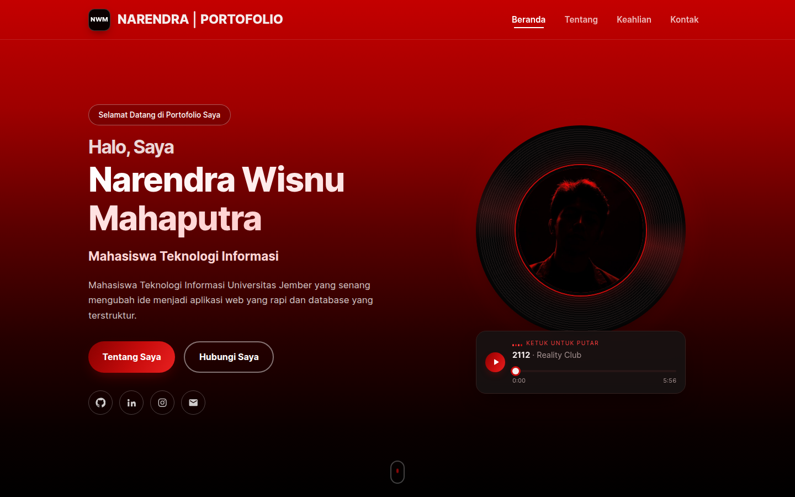
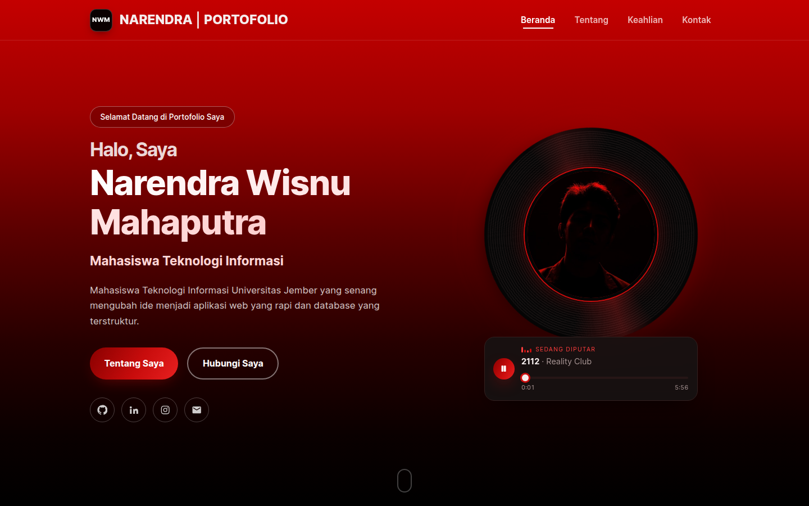
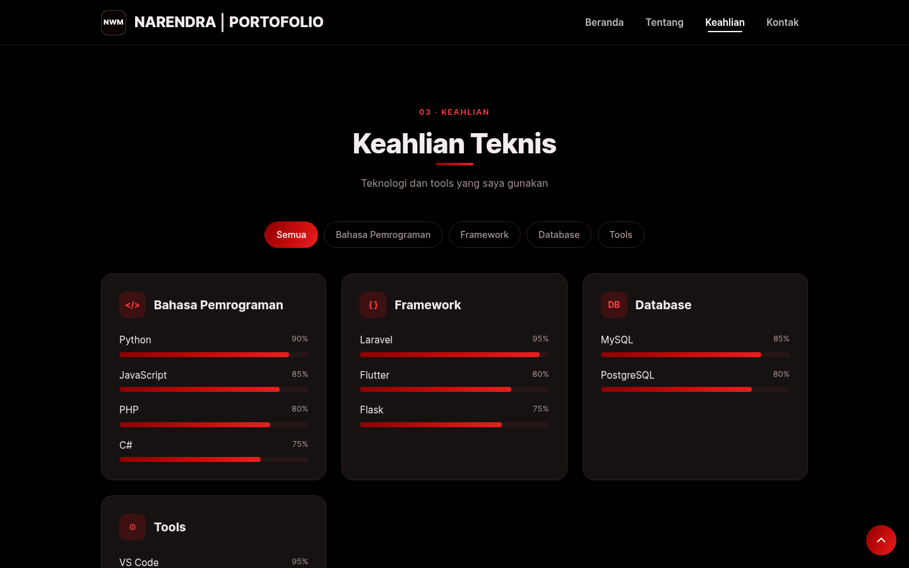
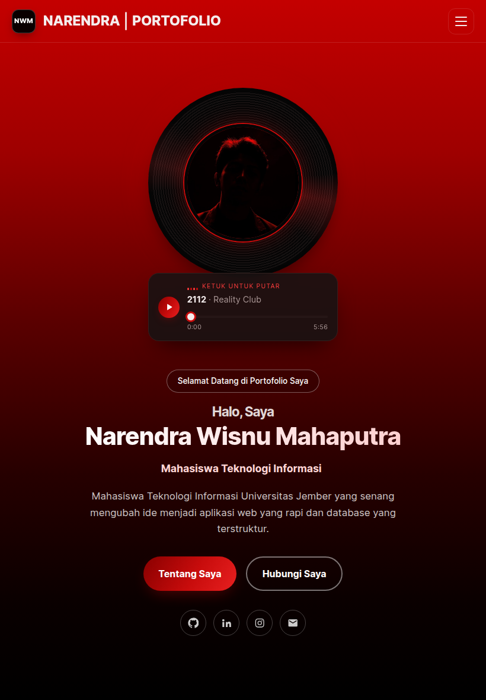
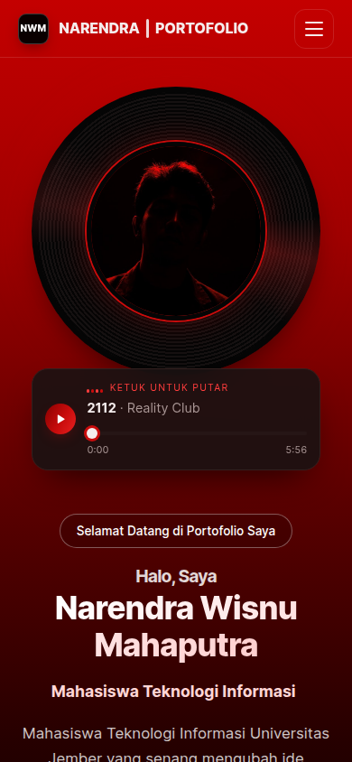
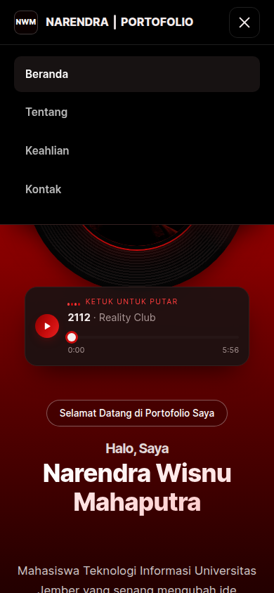
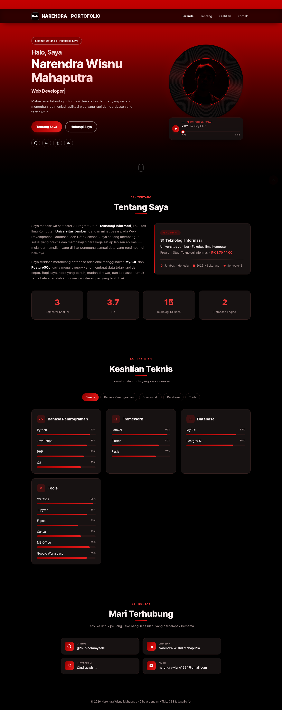

# Portofolio — Narendra Wisnu Mahaputra

Website portofolio pribadi untuk tugas **Slicing Website HTML/CSS/JS** mata kuliah Pemrograman Web.

🔗 **Live demo:** https://ayeen1.github.io/Portofolio/
📂 **Repository:** https://github.com/ayeen1/Portofolio



## Penjelasan Singkat

Website ini adalah portofolio satu halaman (*one-page*) berisi profil saya sebagai mahasiswa
Teknologi Informasi, Fakultas Ilmu Komputer, Universitas Jember. Seluruh konten menggunakan
Bahasa Indonesia, dengan tampilan gradasi **merah ke hitam** dan font **Inter**, terinspirasi
dari lagu **"2112" — Reality Club**.

Website terdiri dari 4 bagian:

| Bagian | Isi |
|---|---|
| **Beranda** | Perkenalan, efek mengetik (*typing effect*), foto profil di piringan hitam, mini music player, media sosial |
| **Tentang** | Deskripsi diri, kartu pendidikan (S1 Teknologi Informasi · IPK 3.70 · Semester 3), counter statistik |
| **Keahlian** | Kartu skill per kategori + filter: Bahasa Pemrograman (Python, JavaScript, PHP, C#), Framework (Laravel, Flutter, Flask), Database (MySQL, PostgreSQL), dan Tools |
| **Kontak** | Link GitHub, LinkedIn, Instagram, dan Email |

## Ketentuan Tugas

- ✅ **Responsive** — mobile, tablet, desktop (breakpoint 1024px, 860px, 480px)
- ✅ **HTML semantik** — `header`, `nav`, `main`, `section`, `article`, `figure`, `address`, `time`, `footer`
- ✅ **Plain CSS** — tanpa Tailwind / Bootstrap; memakai CSS Variables, Flexbox, Grid, dan media query
- ✅ **JavaScript (DOM)**:
  - Kartu skill dibuat dinamis dari array data (`createElement`, `appendChild`)
  - Filter kategori skill
  - Menu hamburger (mobile) + link navbar aktif sesuai section (`IntersectionObserver`)
  - Efek mengetik, counter angka, animasi skill bar, dan animasi muncul saat scroll
  - Mini music player (`<audio>`): play/pause, durasi lagu, progress bar yang bisa digeser, shortcut tombol spasi — piringan hitam ikut berputar saat lagu diputar
  - Tombol kembali ke atas (*back-to-top*)

## Screenshot

**Desktop — Beranda**


**Desktop — Music player sedang diputar**



**Desktop — Keahlian**



**Tablet**



**Mobile**

<p>
  
  
</p>

<details>
<summary>Tampilan satu halaman penuh (desktop)</summary>



</details>

## Struktur Folder

```
portofolio/
├── index.html
├── css/
│   └── style.css
├── js/
│   └── script.js
├── assets/
│   ├── profile.jpg
│   └── 2112.mp3
├── screenshots/
└── README.md
```

## Menjalankan

Buka `index.html` di browser, atau gunakan ekstensi **Live Server** di VS Code
(klik kanan `index.html` → *Open with Live Server*).

## Teknologi

HTML5 · CSS3 · JavaScript (Vanilla) · Google Fonts (Inter)

## Kontak

- GitHub: [ayeen1](https://github.com/ayeen1)
- LinkedIn: [Narendra Wisnu Mahaputra](https://www.linkedin.com/in/narendrawisnu/)
- Instagram: [@ndraawisn_](https://www.instagram.com/ndraawisn_/)
- Email: narendrawisnu1234@gmail.com

---

© 2026 Narendra Wisnu Mahaputra
